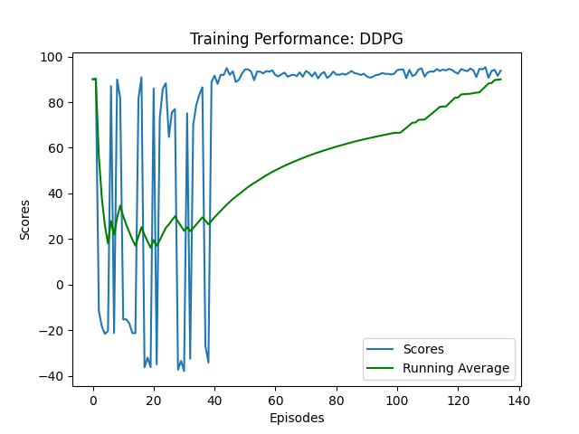

# Solving MountainCarContinuous-v0 with DDPG and REINFORCE Approaches

This project implements two reinforcement learning algorithms to solve the MountainCarContinuous-v0 environment: Deep Deterministic Policy Gradient (DDPG) and REINFORCE (Monte Carlo Policy Gradient). The project provides a comprehensive comparison of these approaches in terms of learning efficiency, stability, and performance.

## Environment Description

MountainCarContinuous-v0 is a classic control problem in reinforcement learning where an under-powered car must drive up a steep mountain. The car's engine is not strong enough to scale the mountain in a single pass, so the agent must learn to build momentum by driving back and forth.

### State Space
- 2-dimensional continuous state: position (-1.2 to 0.6) and velocity (-0.07 to 0.07)

### Action Space
- 1-dimensional continuous action: force applied to the car (-1.0 to 1.0)

### Reward Structure
- Reward of +100 is provided for reaching the goal (position > 0.45)
- Small negative reward proportional to the squared action (energy penalty)
- Episode terminates when the goal is reached or after 999 steps

### Solving Criteria
- The environment is considered solved when the agent achieves an average reward of 90 over 100 consecutive episodes

## Implementation Details

The project implements two distinct reinforcement learning approaches:

### 1. DDPG (Deep Deterministic Policy Gradient)

DDPG is an actor-critic, model-free algorithm designed for continuous action spaces. It combines ideas from DQN and policy gradients to handle the continuous action domain effectively.

**Components:**
- **Actor Network**: Deterministic policy that maps states to specific actions
  - Architecture: 2 → 64 → 64 → 1 with ReLU activations and tanh output
- **Critic Network**: Evaluates the state-action pairs
  - Architecture: (2+1) → 64 → 64 → 1 with ReLU activations
- **Replay Buffer**: Stores transitions (state, action, reward, next_state) for experience replay
  - Capacity: 10,000 transitions
- **Target Networks**: Separate networks for stable learning
  - Soft update rate (τ): 0.01
- **Exploration Strategy**: Ornstein-Uhlenbeck process for temporally correlated noise
  - Parameters: θ = 0.15, σ = 0.3 (decaying to 0.3)

### 2. REINFORCE (Monte Carlo Policy Gradient)

REINFORCE is a policy gradient method that learns a stochastic policy by directly maximizing expected cumulative rewards.

**Components:**
- **Policy Network**: Stochastic policy that outputs a normal distribution over actions
  - Architecture: 2 → 16 → 16 → 2 (mean and log_std) with ReLU activations
- **Optimization**: Gradient ascent on the expected return
  - Learning rate: 5e-4
- **Variance Reduction**: Baseline subtraction (normalizing returns)
- **Exploration**: Inherent in the stochastic policy (sampling from normal distribution)

## Key Algorithmic Differences

| Feature | DDPG | REINFORCE |
|---------|------|-----------|
| Policy Type | Deterministic | Stochastic |
| Action Selection | Direct action output + noise | Sample from distribution |
| Learning Method | TD Learning (bootstrapping) | Monte Carlo (complete episodes) |
| Sample Efficiency | Higher (replay buffer) | Lower (on-policy) |
| Update Frequency | After each step (if buffer has enough samples) | After each episode |
| Exploration | External noise process | Built into policy |

## Setup and Installation

### Dependencies

The project requires the following main dependencies:
- Python 3.9+
- PyTorch 1.9+
- OpenAI Gym 0.21.0
- NumPy
- Matplotlib

### Environment Setup

1. **Create a Conda Environment:**

   ```sh
   conda env create -f gym_torch_env1.yml
   conda activate gym_env
   ```

2. **Install Additional Dependencies (if needed):**

   ```sh
   pip install -r requirements.txt
   ```

## Usage Instructions

### Training Agents

To train the agents from scratch, use the following commands:

#### Train with DDPG

```sh
python train_MountainCarContinuous.py --agent ddpg
```

#### Train with REINFORCE

```sh
python train_MountainCarContinuous.py --agent reinforce
```

The training process will save model weights automatically when the environment is solved or when the training completes.

### Testing Trained Agents

To visualize the performance of trained agents:

#### Test DDPG Agent

```sh
python test_MountainCarContinuous.py -a ddpg
```

#### Test REINFORCE Agent

```sh
python test_MountainCarContinuous.py -a reinforce
```

This will run the agent in the environment with rendering enabled, allowing you to observe the learned behavior.

## Project Structure

- **ddpg.py**: Implementation of the DDPG algorithm
  - `ReplayBuffer`: Memory for experience replay
  - `OUNoise`: Ornstein-Uhlenbeck noise generator for exploration
  - `DDPGAgent`: Main agent integrating actor-critic architecture
  
- **reinforce.py**: Implementation of the REINFORCE algorithm
  - `Reinforce`: Policy network with action distribution sampling
  
- **train_MountainCarContinuous.py**: Training procedures for both algorithms
  - Parameter settings, environment configuration
  - Episode-by-episode training loops
  - Metrics tracking and visualization
  
- **test_MountainCarContinuous.py**: Evaluation scripts for trained agents
  - Visualizes agent behavior in the environment
  - Collects performance statistics
  
- **utils.py**: Shared utility functions and network architectures
  - `Actor`: Neural network for DDPG's deterministic policy
  - `Critic`: Neural network for DDPG's Q-value estimation

## Results and Performance Analysis

Both DDPG and REINFORCE successfully learned to solve the MountainCarContinuous-v0 environment, but with different learning characteristics and performance profiles.

### Training Curves

#### DDPG Training Performance



*Figure 1: Episode rewards and running average during DDPG training*

#### REINFORCE Training Performance


*Figure 2: Episode rewards and running average during REINFORCE training*

### Performance Metrics

| Metric | DDPG | REINFORCE |
|--------|------|-----------|
| Episodes to solve | ~200-300 | ~500-600 |
| Final average score | ~95 | ~92 |
| Training stability | Medium (high variance) | Low (very high variance) |
| Sample efficiency | Higher | Lower |
| Exploration effectiveness | Good (directed exploration) | Variable (stochastic) |
| Computational efficiency | Medium (requires target networks) | High (single network) |

### Key Observations

1. **Learning Speed**: DDPG generally learns faster than REINFORCE due to its off-policy nature and experience replay, which allows more efficient use of collected experiences.

2. **Stability**: REINFORCE shows higher variance in training, with more pronounced fluctuations in episode rewards. This is characteristic of Monte Carlo methods that rely on complete episode returns.

3. **Exploration Strategy**: DDPG's directed exploration through the Ornstein-Uhlenbeck process enables more consistent momentum-building strategies. REINFORCE's stochastic policy allows for diverse exploration but can be less directed.

4. **Final Performance**: Both algorithms achieve similar final performance when solved, with DDPG showing slightly more consistent behavior in the solved state.

## Conclusion

This project demonstrates the application of two different reinforcement learning approaches to a continuous control problem. DDPG offers faster learning and more sample efficiency at the cost of implementation complexity, while REINFORCE provides simplicity but requires more training episodes to converge.

The results highlight the trade-offs between on-policy and off-policy methods, as well as between stochastic and deterministic policies in continuous action spaces. For the MountainCarContinuous environment, both approaches are viable, with DDPG having a slight edge in terms of learning speed and final performance stability.

## License

This project is licensed under the GNU General Public License v2.0 (GPL-2.0) - see the [LICENSE](LICENSE) file for details.

This means you:
- Are free to use, modify, and distribute the software
- Can make derivative works
- Must include the original copyright notice and license
- Must make source code available when distributing the software
- Must license derivative works under the same license

For more information about this license, visit [GNU General Public License v2.0](https://www.gnu.org/licenses/old-licenses/gpl-2.0.en.html).
